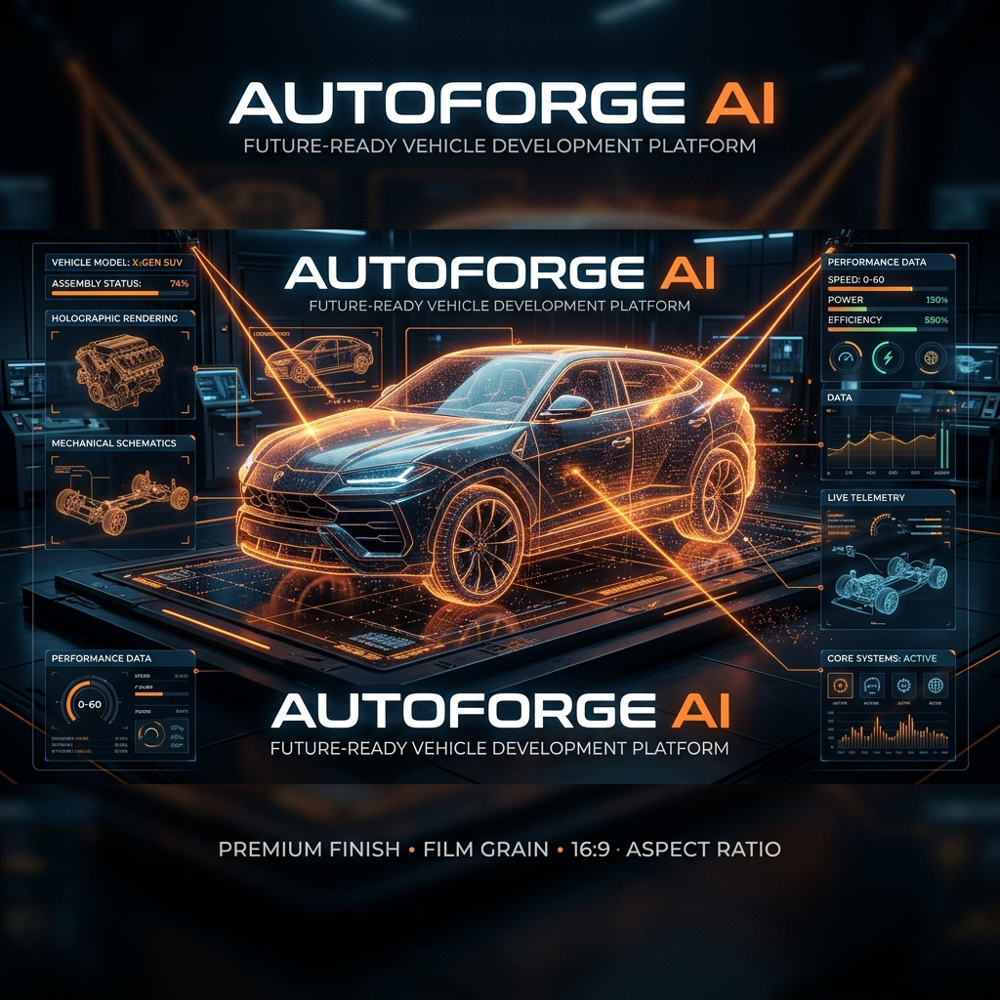

# AutoForge AI — Digital Twin Studio

A prompt-to-vehicle engineering configurator workspace. Convert natural language descriptions into interactive, high-fidelity 3D digital twins with real-time performance telemetry and cost estimation.



---

## 🚀 Overview
AutoForge AI is an advanced platform designed to showcase prompt-to-vehicle design workflows. The application takes an unstructured natural language description of a car, translates it into structured engineering constraints, selects the most suitable 3D base vehicle platform from a catalog, and loads it into a high-fidelity 3D workspace for full customization.

### Key Features
- **Prompt-to-Specification Translation**: Leveraging Google Gemini's structured JSON generation to parse vehicle type, powertrain, seat configurations, aesthetic styles, and engineering properties.
- **Smart Platform Selection**: A deterministic match engine that scores prompt keywords and configuration indicators (terrain type, styling, size) against catalog tags.
- **Interactive 3D Configurator**: Built on **React Three Fiber (R3F)** and **Three.js** to allow real-time changes to the vehicle's paint finish, wheel style, window tint, headlight type, interior upholstery, and ambient studio light.
- **Dual Engine Architecture**: Local deterministic fallback parsing ensures the entire application runs smoothly even without a Gemini API Key.
- **Engineering Analytics**: Instant updates to performance telemetry (Engine Type, Battery Capacity, Horsepower, Torque, 0-60 mph acceleration times, Drivetrain).
- **Project Persistence**: Create, load, and edit vehicle configurations using database storage.
- **PDF Report Generation**: Download detailed specification sheets for any vehicle design using jsPDF.

---

## 🛠️ Tech Stack

### Frontend
- **Framework**: Next.js 15 (App Router, TS)
- **3D Engine**: Three.js, `@react-three/fiber`, `@react-three/drei`
- **Animations**: Framer Motion
- **Styles**: Tailwind CSS
- **Utilities**: jsPDF, Zod, Lucide React

### Backend
- **Framework**: FastAPI (Python 3.11)
- **AI Core**: Google GenAI SDK (Gemini models)
- **Database**: SQLite (Local Dev) / PostgreSQL (Production) with SQLAlchemy
- **Server**: Uvicorn

---

## 📐 Project Structure

```
Auto_Forge/
├── assets/                  # Config catalogs and media assets
│   ├── model-catalog.json   # Curated metadata & tags for 3D platforms
│   └── banner.png           # Project banner image
├── backend/                 # FastAPI backend application
│   ├── app/
│   │   ├── main.py          # FastAPI application & REST endpoints
│   │   ├── database.py      # Database models & engine configuration
│   │   ├── schemas.py       # Pydantic schemas for request/response validation
│   │   └── services.py      # Gemini structured generation & asset selection logic
│   ├── .env.example         # Template for backend environment variables
│   ├── requirements.txt     # Python backend dependencies
│   └── render.yaml          # Render deployment configurations
├── frontend/                # Next.js frontend application
│   ├── app/                 # Next.js App Router (pages and layouts)
│   ├── components/          # React components (Configurator, 3D Canvas, etc.)
│   ├── lib/                 # Type declarations & API clients
│   ├── public/              # Static files (GLB 3D assets, fonts, icons)
│   │   └── models/          # 3D base models (.glb)
│   ├── package.json         # NPM package dependencies
│   └── tailwind.config.ts   # Styling configurations
└── scripts/                 # Utility automation scripts
    └── export_vehicle.py    # Python Blender script for GLB exports
```

---

## ⚙️ Setup & Installation

Follow these steps to run the AutoForge AI MVP locally.

### Prerequisites
- **Python 3.11+**
- **Node.js 18+** & **npm**

---

### 1. Backend Setup

1. Navigate to the `backend` directory:
   ```bash
   cd backend
   ```
2. Create and activate a virtual environment:
   ```powershell
   # On Windows (PowerShell)
   python -m venv .venv
   .\.venv\Scripts\Activate.ps1
   
   # On macOS/Linux
   python -m venv .venv
   source .venv/bin/activate
   ```
3. Install dependencies:
   ```bash
   pip install -r requirements.txt
   ```
4. Copy the environment template and configure your keys:
   ```powershell
   # On Windows
   Copy-Item .env.example .env
   
   # On macOS/Linux
   cp .env.example .env
   ```
   Modify `.env` to include your Google Gemini API Key:
   ```env
   GEMINI_API_KEY="your-api-key-here"
   ALLOWED_ORIGINS="http://localhost:3000"
   ENVIRONMENT="development"
   ```
   > [!NOTE]
   > If no `GEMINI_API_KEY` is provided, the backend falls back to standard regex parsing, ensuring the application remains completely runnable offline.

5. Start the FastAPI development server:
   ```bash
   uvicorn app.main:app --reload --port 8000
   ```
   The backend will be available at `http://localhost:8000`. You can inspect the interactive OpenAPI documentation at `http://localhost:8000/docs`.

---

### 2. Frontend Setup

1. Navigate to the `frontend` directory:
   ```bash
   cd frontend
   ```
2. Install npm packages:
   ```bash
   npm install
   ```
3. Set up environment variables:
   Create a `.env` (or `.env.local`) file inside the `frontend` folder:
   ```env
   NEXT_PUBLIC_API_URL=http://localhost:8000
   NEXT_PUBLIC_APP_NAME=AutoForge AI
   ```
4. Start the Next.js development server:
   ```bash
   npm run dev
   ```
   Open `http://localhost:3000` in your browser to view the application.

---

## 🚘 Smart 3D Platform Selection

The backend automatically scores user prompts against registered platforms in `assets/model-catalog.json`.

Available Base Models:
- 🇬🇧 **Range Rover Sport** (`range-rover-suv`): Selected for luxury, elegance, comfort, and premium specs.
- 🇮🇳 **Mahindra Thar** (`mahindra-thar`): Selected for rugged off-road terrains, 4x4, expeditions, and outdoor adventures.
- 🇩🇪 **Mercedes AMG** (`mercedes-amg`): Selected for modern city executive styling, high-performance urban use.
- 🇺🇸 **Chevrolet SUV** (`chevy-suv`): Selected for family, spacious commutes, and budget-friendly practicality.

---

## 🛠️ Blender Asset Pipeline

If you wish to export custom vehicle bases from Blender, use the included export automation script:

```powershell
& "C:\Program Files\Blender Foundation\Blender 4.5\blender.exe" `
  --background "C:\path\to\your-source.blend" `
  --python "scripts/export_vehicle.py" `
  -- "frontend/public/models/your-vehicle-name.glb"
```

Then, register the new model in `assets/model-catalog.json` so the smart selection system can map user intents to it.

---

## 🌐 Deployment
For instructions on deploying the frontend to **Vercel** and the backend to **Render**, please refer to the detailed [Deployment Guide](file:///c:/Users/LENOVO/Desktop/Auto_Forge/DEPLOYMENT.md).
